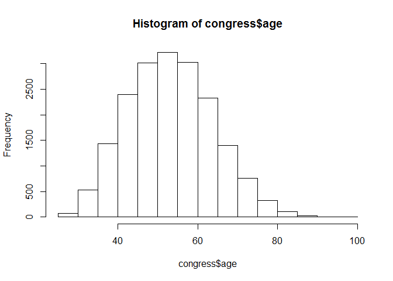
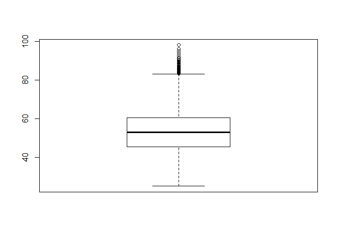
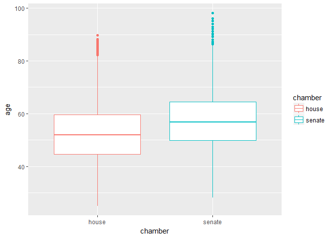
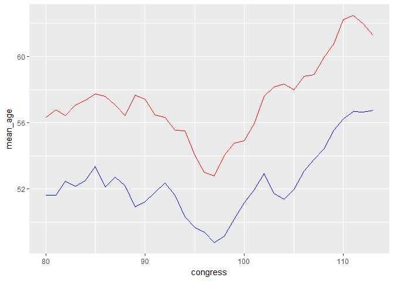
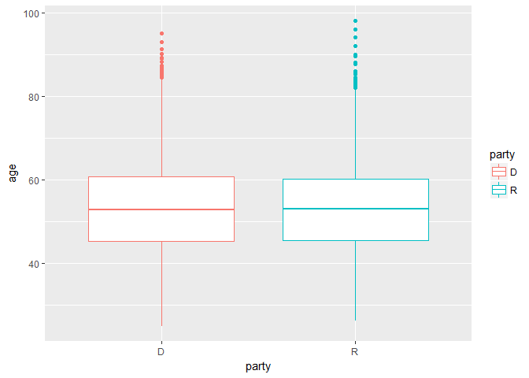
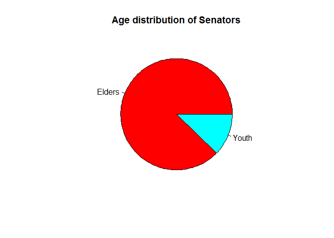
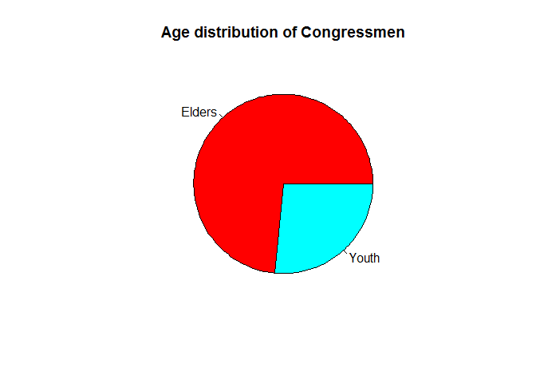
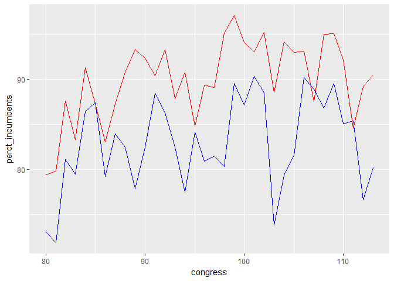
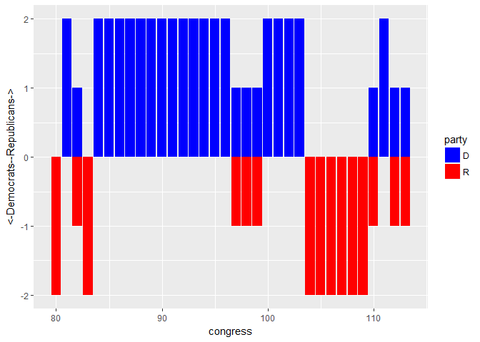

US Congress-hackathon
================

The Dataset - Congress
======================

``` r
congress = read.csv('D:/EDA/Hackathon/Data Set.csv', na.strings = '')
str(congress)
```

    ## 'data.frame':    18635 obs. of  15 variables:
    ##  $ congress  : int  80 80 80 80 80 80 80 80 80 80 ...
    ##  $ chamber   : Factor w/ 2 levels "house","senate": 1 1 1 1 1 1 1 1 1 1 ...
    ##  $ bioguide  : Factor w/ 3192 levels "A000001","A000002",..: 1862 799 2567 866 1746 1055 3049 210 1400 1085 ...
    ##  $ firstname : Factor w/ 810 levels "Aaron","Abe",..: 427 660 8 142 790 387 657 711 559 142 ...
    ##  $ middlename: Factor w/ 955 levels "(Jim) Guy","A.",..: 495 559 501 54 NA 2 508 NA NA 538 ...
    ##  $ lastname  : Factor w/ 2288 levels " "," III"," IV",..: 1337 584 1834 617 1263 765 2200 174 1047 797 ...
    ##  $ suffix    : Factor w/ 7 levels "du Pont","II",..: NA NA NA NA NA NA NA NA NA NA ...
    ##  $ birthday  : Factor w/ 3062 levels "1/1/1900","1/1/1902",..: 844 845 847 849 850 851 853 854 855 856 ...
    ##  $ state     : Factor w/ 52 levels "1/22/1935","5/9/1932",..: 45 29 16 33 19 40 7 36 50 21 ...
    ##  $ party     : Factor w/ 10 levels "3/15/1926","4/23/1941",..: 4 4 4 10 10 10 10 4 10 10 ...
    ##  $ incumbent : Factor w/ 5 levels "NC","NE","No",..: 5 5 5 5 3 3 5 5 5 5 ...
    ##  $ termstart : Factor w/ 38 levels "1/10/1967","1/14/1975",..: 5 5 5 5 5 5 5 5 5 5 ...
    ##  $ age       : Factor w/ 615 levels " ","1/14/1975",..: 589 1 550 531 526 523 522 511 503 501 ...
    ##  $ X         : Factor w/ 15 levels "1/3/1983","1/3/1985",..: NA NA NA NA NA NA NA NA NA NA ...
    ##  $ X.1       : num  NA NA NA NA NA NA NA NA NA NA ...

-   The dataset contains details about the US legislators in both the House of Representatives and The Senate starting from 1947 to 2013

Data Cleaning
=============

-   We see that the dataset contains many errors that we need to rectify in order to get correct analysis.
-   As the file was .csv, while importing into R , the commas contained in the names got seperated into different columns. two extra clumns got created = X ,X.1
-   we rectify this first!

``` r
congress$firstname = as.character(congress$firstname)
congress$lastname = as.character(congress$lastname)
congress$middlename = as.character(congress$middlename)
congress$suffix = as.character(congress$suffix)

congress[!is.na(congress$X.1),]$middlename = paste(congress[!is.na(congress$X.1),]$middlename,congress[!is.na(congress$X.1),]$lastname, sep = ',')
congress[!is.na(congress$X.1),]$lastname = NA

#View(congress[!is.na(congress$X.1),])

congress$birthday = as.character(congress$birthday)
congress[!is.na(congress$X.1),]$lastname = congress[!is.na(congress$X.1),]$birthday
congress[!is.na(congress$X.1),]$birthday = NA


congress$party = as.character(congress$party)
congress$state = as.character(congress$state)
congress$incumbent = as.character(congress$incumbent)
congress$termstart = as.character(congress$termstart)
congress$age = as.character(congress$age)
congress$X = as.character(congress$X)
congress$X.1 = as.character(congress$X.1)

#congress[!is.na(congress$X.1),]$birthday = congress[!is.na(congress$X.1),]$party

for (i in 8:13)
{
  congress[!is.na(congress$X.1),i] = congress[!is.na(congress$X.1),i+2]
}

congress[!is.na(congress$X.1),]$X = NA
congress[!is.na(congress$X.1),]$X.1 = NA

# rows with two gaps done!

#View(congress[!is.na(congress$X),])

for (i in 8:13)
{
  congress[!is.na(congress$X),i] = congress[!is.na(congress$X),i+1]
}

congress[!is.na(congress$X),]$X = NA
congress$X = NULL
congress$X.1 = NULL

# REFORMATTING THE DATA FRAME


congress$age = as.numeric(congress$age)

colSums(is.na(congress))
```

    ##   congress    chamber   bioguide  firstname middlename   lastname 
    ##          0          0          0          0       3536          0 
    ##     suffix   birthday      state      party  incumbent  termstart 
    ##      16947          0          0          0          0          0 
    ##        age 
    ##          4

``` r
#View(congress[is.na(congress$age),])

congress[is.na(congress$age),]$age = (as.Date(congress[is.na(congress$age),]$termstart,'%m/%d/%Y') - as.Date(congress[is.na(congress$age),]$birthday,'%Y-%m-%d'))/365

#View(congress[which(is.na(as.Date(congress$birthday))),])

congress[which(is.na(as.Date(congress$birthday))),]$birthday =  as.character(as.Date(congress[which(is.na(as.Date(congress$birthday))),]$birthday,'%m/%d/%Y'))

congress$birthday = as.Date(congress$birthday)
congress$termstart = as.Date(congress$termstart,'%m/%d/%Y')

# data pre processing done!!
```

Average Age of Legislators
==========================

``` r
hist(congress$age)
```



``` r
boxplot(congress$age)
```



``` r
quantile(congress$age)
```

    ##    0%   25%   50%   75%  100% 
    ## 25.00 45.40 53.00 60.55 98.10

``` r
mean(congress$age)
```

    ## [1] 53.31374

Average age of senators vs congressmen
======================================

``` r
chamber_age = congress %>% group_by(chamber) %>% summarise(mean_age = mean(age)) 
chamber_age
```

    ## # A tibble: 2 x 2
    ##   chamber mean_age
    ##    <fctr>    <dbl>
    ## 1   house 52.36662
    ## 2  senate 57.33553

``` r
ggplot(data = congress) +geom_boxplot(aes(x = chamber,y = age,colour = chamber))
```



Average age of chamber members over the years
=============================================

``` r
#average age of chamber members over the years
year_age = congress %>% group_by(congress,chamber) %>% summarise(mean_age = mean(age)) 
kable(year_age[1:10,])
```

|  congress| chamber |  mean\_age|
|---------:|:--------|----------:|
|        80| house   |   51.63651|
|        80| senate  |   56.31373|
|        81| house   |   51.63728|
|        81| senate  |   56.76881|
|        82| house   |   52.48489|
|        82| senate  |   56.43810|
|        83| house   |   52.16479|
|        83| senate  |   57.05526|
|        84| house   |   52.49615|
|        84| senate  |   57.34466|

``` r
house_age = year_age %>% filter(chamber == 'house')
senate_age = year_age %>% filter(chamber == 'senate')
ggplot() + geom_line(data = house_age,aes(x = congress,y = mean_age),colour = 'blue') + geom_line(data = senate_age,aes(x = congress,y = mean_age),colour = 'red') 
```



-   The Senate as the upper house is rightly called the house of elders. The average age of senators has always been more than the house representatives.
-   Also, in recent years the average age of legislators have been increasing which shows a low interest of the younger generation to join politics!
-   This can prove dangerous as 65% of the world population today is under-35, where as their representation in law making bodies is low.

Average age of Democrats vs Republicans
=======================================

``` r
party_age = congress %>% group_by(party) %>% summarise(mean_age = mean(age)) 
kable(party_age)
```

| party |  mean\_age|
|:------|----------:|
| AL    |   42.30000|
| D     |   53.43147|
| I     |   54.06032|
| ID    |   55.10000|
| L     |   34.40000|
| R     |   53.16705|

``` r
congress %>% filter(party %in% c('D','R')) %>%  ggplot() + geom_boxplot(aes(x = party, y = age, colour = party))  
```



Elders vs Youth
===============

``` r
congress$age_category = ifelse(congress$age>45,'Elders','Youth')

proportion = congress %>% group_by(age_category,chamber) %>% summarise(perct = n()) 
kable(proportion)
```

| age\_category | chamber |  perct|
|:--------------|:--------|------:|
| Elders        | house   |  11087|
| Elders        | senate  |   3115|
| Youth         | house   |   3996|
| Youth         | senate  |    437|

``` r
proportion_senate = proportion %>% filter(chamber == 'senate')
proportion_house = proportion %>% filter(chamber == 'house')

proportion_senate$perct = proportion_senate$perct/sum(proportion_senate$perct)* 100
proportion_house$perct = proportion_house$perct/sum(proportion_house$perct)* 100

#ggplot() + geom_bar(data = proportion_senate, aes(x = age_category, y= perct, fill = age_category),stat = 'identity') 
#ggplot() + geom_bar(data = proportion_house, aes(x = age_category, y= perct, fill = age_category),stat = 'identity') 
pie(proportion_senate$perct,labels = proportion_senate$age_category,main = 'Age distribution of Senators',col = rainbow(2))
```



``` r
pie(proportion_house$perct,labels = proportion_house$age_category,main = 'Age distribution of Congressmen',col = rainbow(2))
```

 - The youth representation in House of Represenatatives is higher than in Senate

Percentage of Incumbents in each house over the years
=====================================================

``` r
incumbents_senate = congress %>% filter(chamber == 'senate') %>% group_by(congress) %>% summarise(perct_incumbents = length(which(incumbent == 'Yes'))/n()*100) 

incumbents_house = congress %>% filter(chamber == 'house') %>% group_by(congress) %>% summarise(perct_incumbents = length(which(incumbent == 'Yes'))/n()*100)

ggplot() + geom_line(data = incumbents_senate, aes(x = congress, y = perct_incumbents),colour = 'red') +
  geom_line(data = incumbents_house, aes(x = congress, y = perct_incumbents),colour = 'blue') 
```



``` r
mean(incumbents_senate$perct_incumbents)
```

    ## [1] 89.94812

``` r
mean(incumbents_house$perct_incumbents)
```

    ## [1] 82.92803

-   The incumbent rate for botht the houses is high above 80%!. It is 89% for Senate and 82% for House of Represenatatives.

Democrats vs Republicans having majority across the two houses
==============================================================

``` r
win = congress %>% group_by(congress,chamber,party) %>% summarise(count =n())  


win_party = win %>%group_by(congress,chamber) %>% filter(count == max(count))


win_congress = subset(win_party,select =c(congress,chamber,party))
win_congress_plot = win_congress %>% mutate(govt = ifelse(party == 'D',1,ifelse(party=='R',-1,0)),party = party)
plot = win_congress_plot %>% group_by(congress,party) %>% summarise(Same_or_diff = sum(govt,na.rm =T))
ggplot(data = plot) + geom_bar(aes(x=congress, y = Same_or_diff, fill = party),stat = 'identity') + ylab("<-Democrats--Republicans->") + scale_fill_manual(values = c('Blue','Red'))
```



Machine Learning!
=================

-   As an exploration, we will try to use Machine Learning to predict the party that a Congressman belongs to using the data available.

Subsetting the right dataset!
=============================

``` r
ml = congress[,c('congress','chamber','state','party','incumbent','age','termstart')]
ml$chamber = factor(ml$chamber, levels = c('house','senate'), labels = c(1,2))
ml$state = as.factor(ml$state)
ml$state = factor(ml$state, levels = levels(ml$state), labels = 1:50)
ml$party = as.factor(ml$party)
ml$party = factor(ml$party, levels =levels(ml$party),labels = 1:6)
ml$incumbent = as.factor(ml$incumbent)
ml$incumbent = factor(ml$incumbent, levels = levels(ml$incumbent), labels = 1:2)
```

-   For this data we have limited data as many other factors would determine the party to which a legislators belongs to. However, we go ahead with this ML excercise, calling it Exploratory Machine Learing!

``` r
library(caTools)
set.seed(100)
split = sample.split(ml$party,SplitRatio = 0.8)
training_set = subset(ml, split == TRUE)
test_set = subset(ml,split == FALSE)


library(randomForest)
classifier = randomForest(x = training_set[-c(4)],
                          y = training_set$party,
                          ntree = 500)
y_pred = predict(classifier,newdata = test_set[-c(4)])


#comparing results
test_set = cbind(test_set,y_pred)
test_set$results = ifelse(test_set$party==test_set$y_pred,"Correct","Incorrect")
length(which((test_set$results=="Correct")))/length(test_set$results)
```

    ## [1] 0.5799356

``` r
classifier$importance
```

    ##           MeanDecreaseGini
    ## congress          483.0422
    ## chamber           138.2047
    ## state            2012.5371
    ## incumbent         125.2456
    ## age              1533.2416
    ## termstart         487.6006

-   we see here that state is the highest predictor of a senator's party affiliation. So historically, the notion of *'Red States and Blue States'* holds ground, even though Obama may later go on to make the most iconic speech of *'One United States of America'* before becoming President!!
-   Age is another surprising indicator of high importance. But we had seen that there was no big difference in Aerage Age of Republicans vs Democrats. So we will try removing the variable and compute if we get better accuracy.
-   Termstart is the 3rd most important variable, as it captures the political climate of the country at the time of elections. If a political wave exists in favour of one or the other party, it does impact the party from which legislators are getting elected into Congress.
